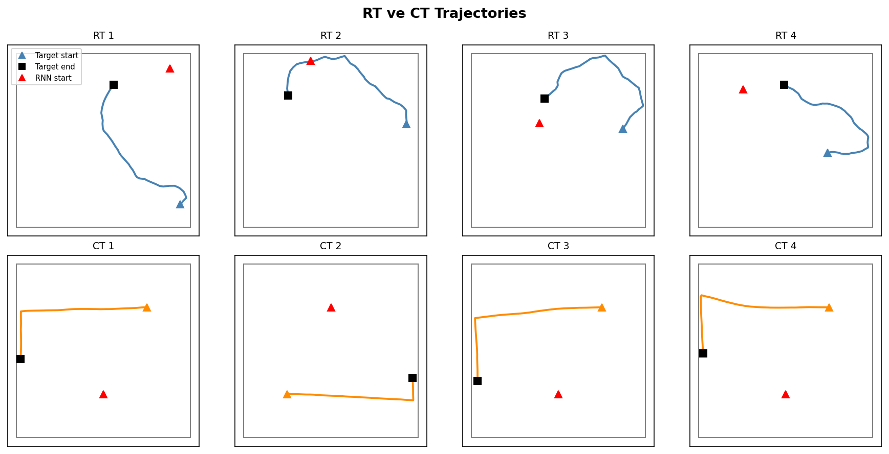
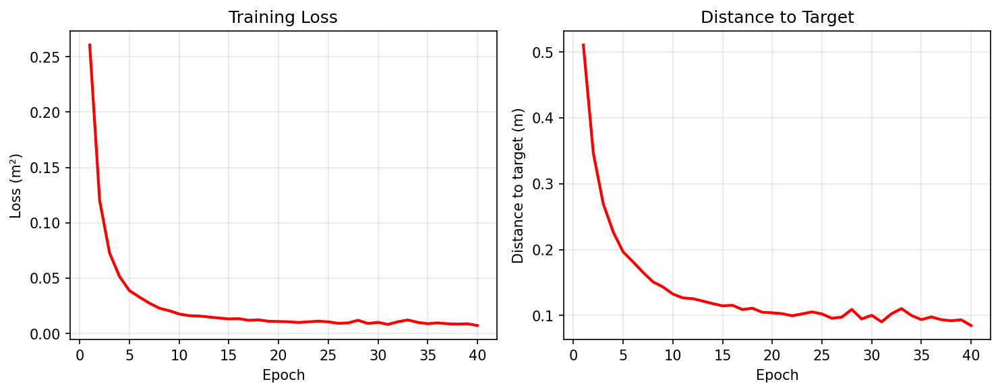
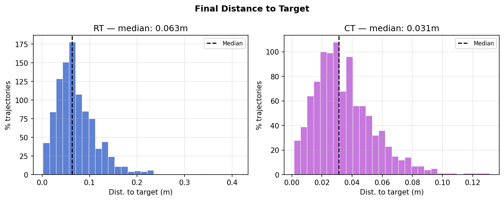
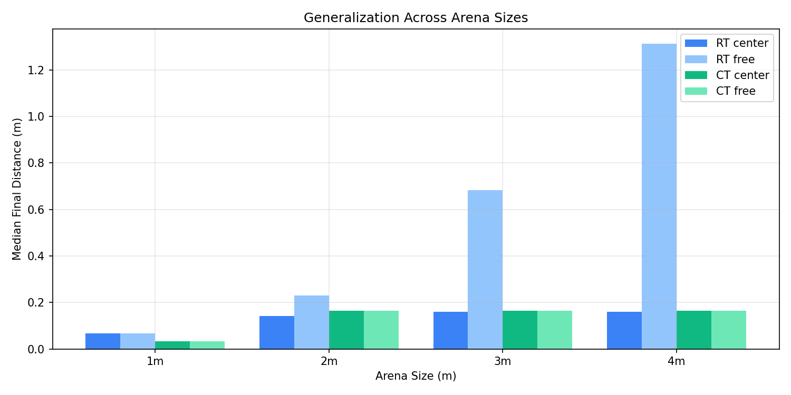

# Predictive Pursuit Emerges in High-Dimensional Recurrent Neural Networks

 **Reproduction of Redman, Dinç et al.** 

Damla ☘

---

##  Motivation: What is the Problem?

* **Concern:** A moving target in a 2D arena — can a network learn to chase it?
* **Biological Inspiration:**   
  * Spatial mapping in the brain
  * Predator-prey dynamics
* **Goal:**  "We train an RNN to **predict** where a target will be and navigate to it."

---

##  The Environment

* **Target Physics:** Moves with Rayleigh-distributed speed and random turning angles.
* **Two Trajectory Types:**
  * **RT (Random Trajectory):** Stochastic, unpredictable sharp turns.
  * **CT (Characteristic Trajectory):** Structured diagonal patterns.

<center>
  
</center>

---

##  RT vs CT: Video Demo

<style>
.video-container {
  display: flex;
  justify-content: space-around;
  align-items: flex-start;
  gap: 30px;
  margin-top: 30px;
}
.video-col {
  flex: 1;
  display: flex;
  flex-direction: column;
  align-items: center;
}
.video-title {
  font-size: 24px;
  font-weight: bold;
  margin-bottom: 15px;
}
</style>

<div class="video-container">

  <div class="video-col">
    <span class="video-title" style="color: #f43f5e;">Random Trajectory (RT)</span>
    <video src="/Users/damlademirok/Desktop/uscb/rnn/pursuit_rnn/videos/RT_1.mp4" width="100%" controls autoplay loop muted style="border-radius: 8px; border: 2px solid #f43f5e;"></video>
  </div>

  <div class="video-col">
    <span class="video-title" style="color: #10b981;">Characteristic Trajectory (CT)</span>
    <video src="/Users/damlademirok/Desktop/uscb/rnn/pursuit_rnn/videos/CT_1.mp4" width="100%" controls autoplay loop muted style="border-radius: 8px; border: 2px solid #10b981;"></video>
  </div>

</div>

<center style="margin-top: 35px; font-style: italic; color: #a3a3a3; font-size: 18px;">
  Caption: Black = target, Red = RNN agent
</center>
---

##  Model Architecture

Inputs ($z_{\text{RNN}}(0)$, $z_{\text{target}}(0)$, velocity updates $u(t)$) pass through weights to output heading angle $\theta$ and speed $v$.

| Weight | Shape | Role |
| :--- | :---: | :--- |
| $W_{\text{back}}$ | $N \times 4$ | Initialization from absolute positions |
| $W_{\text{in}}$ | $N \times 2$ | Processing velocity inputs $u(t)$ |
| $W_{\text{rec}}$ | $N \times N$ | Recurrent hidden state dynamics |
| $W_{\text{out}}$ | $2 \times N$ | Decoding network state into angle + speed |

---

##  RNN Dynamics: The Equations

* **1. Initialization:**
  $$r(0) = W_{\text{back}} \cdot [z_{\text{RNN}}(0),\ z_{\text{target}}(0)]$$
* **2. Recurrent Update:**
  $$r(t+1) = \text{ReLU}\bigl(W_{\text{rec}} \cdot r(t) + W_{\text{in}} \cdot u(t) + b\bigr)$$
* **3. Output Decoding:**
  $$o(t) = W_{\text{out}} \cdot r(t), \quad \theta = o_0, \quad v = \sigma(o_1) \cdot v_{\text{max}}$$
* **4. Position Update:**
  $$z_{\text{RNN}}(t+1) = z_{\text{RNN}}(t) + v \cdot dt \cdot [\cos\theta,\ \sin\theta]$$

---

##  Training: The Loss Function

* **Primary Objective (Pursuit Loss):** Minimize distance at the final.
  $$\mathcal{L}_{\text{end}} = \frac{1}{B} \sum_{b=1}^B \|z_{\text{RNN}}^{(b)}(T) - z_{\text{target}}^{(b)}(T)\|^2$$
* **Regularized Loss - unused (Neural/Energy Regularization):**
  $$\mathcal{L} = \mathcal{L}_{\text{end}} + \lambda_r \underbrace{\langle r^2 \rangle}_{\text{neural cost}} + \lambda_v \underbrace{\langle v^2 \rangle}_{\text{movement cost}}$$
* **Hyperparameters:** Adam optimizer, $\text{lr} = 2 \times 10^{-5}$, 100 epochs, batch size 400.
* **Batch Composition:** 75% RT + 25% CT trajectories per batch.

---

##  Training Loop (Conceptual)

```python
for epoch in range(epochs):
    # 1. Sample mixed batch (75% RT, 25% CT)
    X_batch, y_batch = sample_mixed_trajectories(batch_size=400)
    
    # 2. Run RNN forward for T = 50 steps
    hidden_states, agent_positions = rnn_forward(X_batch)
    
    # 3. Compute loss (Final distance squared + regularization)
    loss = compute_loss(agent_positions, y_batch, hidden_states)
    
    # 4. Backpropagate and update weights
    loss.backward()
    optimizer.step()
```
---

## — Training: Loss Curve

<br>

<center>
  
</center>

<center style="margin-top: 20px; font-style: italic; color: #a3a3a3;">
  Loss drops sharply in first 5 epochs, converges by epoch 40. 
  Training stopped at epoch 40 with early stopping (loss < 0.007).
</center>

--- 

## — Results: Distance Distributions
<br>

<center>
  
</center>

<center style="margin-top: 12px; font-weight: bold; color: #38bdf8;">
  RT median: 0.063m | CT median: 0.031m 
</center>

---
## — Generalization: Arena Size Experiments

<br>


<div style="display: flex; justify-content: space-around; margin-top: 20px; font-size: 18px;">
  <div>
    <span style="color: #38bdf8; font-weight: bold;"></span><br>
    RT performance degrades with arena size —<br>
    model was trained on 1m, larger arenas are unseen.
  </div>
  <div>
    <span style="color: #10b981; font-weight: bold;"></span><br>
    CT performance remains stable across all arenas —<br>
    structured trajectories generalize robustly.
  </div>
  <div>
    <span style="color: #f43f5e; font-weight: bold;"></span><br>
    Center bias matters for RT but not CT —<br>
    starting position determines reachability.
  </div>
</div>

---

## Area Experiment Results

<br>

<center>
  
</center>

---
## Arena Results: Center Bias

<br>

| Arena | RT Median | CT Median | RT | CT |
| :---: | :---: | :---: | :---: | :---: |
| 1m | 0.067m | 0.033m | ✅ | ✅ |
| 2m | 0.141m | 0.164m | ⚠️ | ⚠️ |
| 3m | 0.161m | 0.164m | ⚠️ | ⚠️ |
| 4m | 0.161m | 0.164m | ⚠️ | ⚠️ |

<br>

<center style="margin-top: 25px; font-style: italic; color: #a3a3a3;">
✅ &lt; 0.1m — near training performance &nbsp;|&nbsp; ⚠️ 0.1–0.5m — degraded
</center>

---

## Arena Results: Free Start

<br>

| Arena | RT Median | CT Median | RT | CT |
| :---: | :---: | :---: | :---: | :---: |
| 1m | 0.067m | 0.032m | ✅ | ✅ |
| 2m | 0.230m | 0.164m | ⚠️ | ⚠️ |
| 3m | 0.682m | 0.164m | 🚫 | ⚠️ |
| 4m | 1.312m | 0.164m | 🚫 | ⚠️ |

<br>

<center style="margin-top: 25px; font-style: italic; color: #a3a3a3;">
✅ &lt; 0.1m &nbsp;|&nbsp; ⚠️ 0.1–0.5m degraded &nbsp;|&nbsp; 🚫 &gt; 0.5m — beyond physical reach (max 1.125m in 50 steps)
</center>


---
## — Conclusion: Findings

<style scoped>
section { font-size: 27px; }
</style>

* **Pursuit works:** A 1024-neuron RNN trained on 40 epochs ends median distance of **0.063m (RT)** and **0.031m (CT)** — comparable to paper.

* **CT > RT:** Structured trajectories are easier to pursue — the model learns the L-shaped pattern and anticipates the turn.

* **Arena generalization is asymmetric:**
  * CT performance stays stable across 1m → 4m arenas (~0.16m median)
  * RT performance degrades rapidly beyond 1m, especially with free start
  * Physical constraint: model can travel max **1.125m** in 50 steps

* **Center bias matters for RT, not CT:** Starting position determines reachability for random trajectories, but structured trajectories are robust regardless.

* **Wall information is implicitly encoded:** CT without walls (3m–4m/free) fails,L-turn trigger disappears — the model learned wall-dependent behavior.

---
## — Conclusion: Next Steps

<style scoped>
section { font-size: 27px; }
</style>

* **Neural analysis:** Examine hidden state $r(t)$ dynamics — do egocentric target units (ETUs) emerge as in the paper?

* **Energy regularization:** Compare models trained with and without metabolic cost $\lambda_r \langle r^2 \rangle + \lambda_v \langle v^2 \rangle$ — does it change pursuit strategy?

* **Low-rank experiments:** Does predictive behavior require high-dimensional connectivity?

* **Longer training:** Current model trained for 40 epochs/end at loss <0.07. Would longer training change the results?

* **Max speed engagement:** Changing the max_speed possible with the area size in training. Would this made the results more consistent?

* **Periodic boundaries:** Extending environment to torus topology — does the model learn to anticipate wrap-around?